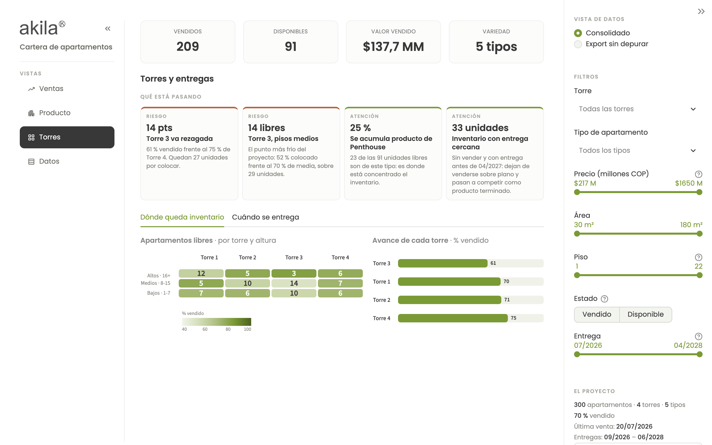
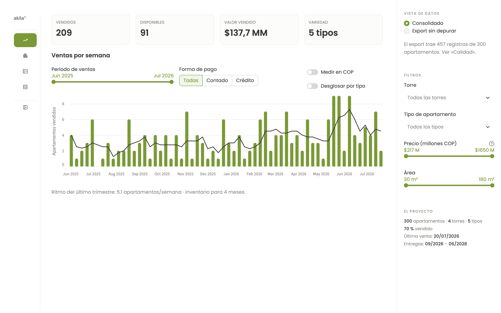
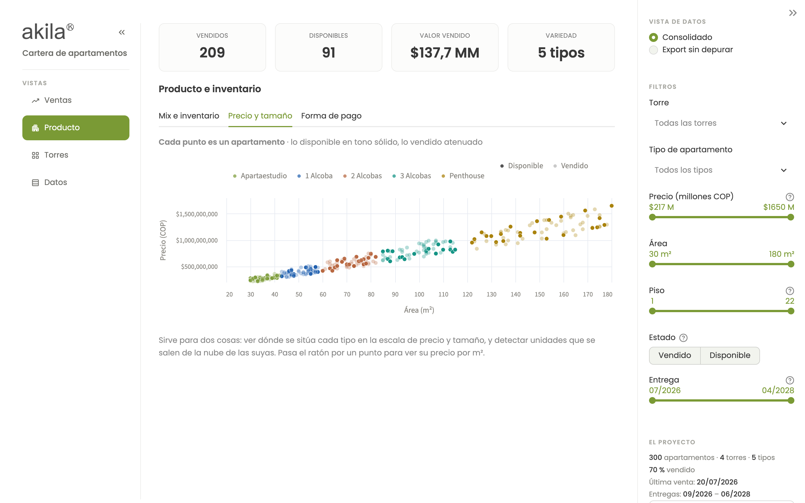

# Ejercicio 2 · Dashboard de ventas de apartamentos

Dashboard para dirección sobre la cartera de un proyecto de vivienda: cuánto se
ha vendido, a qué ritmo, qué producto queda y cuánto durará el inventario.

---

## Cómo ejecutarlo

Desde la **raíz del repositorio**, con el entorno ya instalado
([ver README raíz](../README.md)):

```bash
streamlit run ejercicio2_dashboard/dashboard/app.py
```

Se abre en `http://localhost:8501`.

---

## Lo primero que hay que saber sobre estos datos

El fichero se presenta como «cada fila es un apartamento». No lo es.

**457 filas · 300 apartamentos reales.** 109 unidades aparecen entre dos y siete
veces, y las copias **se contradicen entre sí**: distinto tipo, distinta área,
distinto precio, distinta fecha de entrega y, en 58 casos, distinto estado. Hay
47 unidades que figuran vendidas más de una vez en fechas diferentes.

Un ejemplo real del fichero, `Torre 1 Apto 2003`:

| id | tipo | área | precio | estado | fecha de venta |
|---|---|---|---|---|---|
| 4 | Apartaestudio | 38 m² | $351.400.000 | Disponible | — |
| 397 | 1 Alcoba | 57 m² | $389.600.000 | Vendido | 2026-04-16 |

Mismo apartamento físico (torre, piso y puerta), dos versiones incompatibles.

**Esto cambia las cifras de dirección de forma material:**

| | Leyendo el fichero tal cual | Consolidado |
|---|---|---|
| Apartamentos vendidos | 271 | **209** |
| Disponibles | 186 | **91** |
| Total del proyecto | 457 | **300** |

Presentar «271 vendidos» sería reportar un 30 % de ventas que no existen. Por eso
el dashboard **no esconde el problema**: la vista «Datos» lo explica entero
—las cifras, la regla y un caso real del fichero— junto a las dos tablas, la
consolidada y la del export tal cual, y deja comparar ambas lecturas. Elegir el export sin depurar saca
además un aviso en rojo a pantalla completa, porque esa es la lectura que
engaña.


*El selector en «Export sin depurar»: las mismas fórmulas sobre los datos sin
consolidar dan 271 vendidos y un 59 % de avance. El aviso rojo está ahí para que
nadie tome una decisión con esta vista por accidente.*

### La regla de consolidación

Un apartamento se identifica por **torre + piso + puerta**. Cuando hay varias
filas para la misma unidad:

1. **Si alguna dice «Vendido», la unidad está vendida**, y manda el registro de
   la **venta más reciente**. Una venta es un hecho fechado y con contraparte: es
   la evidencia más fuerte que hay en el fichero, y el registro que la acompaña
   (tipo, área, precio) es el que se firmó.
2. **Si no hay ninguna venta**, manda el **último registro** del inventario, por
   ser la versión más actual.

Los empates de fecha se rompen por `id` descendente, así que el resultado no
depende del orden de lectura.

**Alternativas que se consideraron y por qué se descartaron:**

- *Quedarse con la última fila de cada unidad* (id más alto): daría 184 vendidos,
  porque una fila «Disponible» posterior borraría una venta ya registrada. Se
  perderían ventas reales.
- *Eliminar todas las unidades en conflicto*: descartaría 109 de 300 unidades, un
  tercio del proyecto.
- *Promediar los valores en conflicto*: inventaría apartamentos que no existen —
  un «2,5 alcobas» de 65 m² no se le puede enseñar a nadie.

No hay una respuesta única, y por eso la regla está documentada, es configurable
en el código y el dashboard permite ver las dos lecturas.

**Y una hipótesis sobre el origen**, que conecta con el Ejercicio 1: entre los
correos hay uno de un cliente que **desiste de la compra del apartamento 605**.
Si el sistema de origen registra cada operación como una fila nueva en lugar de
actualizar la existente, una unidad vendida, desistida y revendida deja
exactamente el rastro que se ve aquí. El arreglo de fondo no está en el
dashboard: está en el proceso que genera el export.

---

## Qué muestra


**Los cinco apartados del enunciado:**

1. **Ventas por semana** — barras semanales (semanas ISO, etiquetadas por su
   lunes), conmutables entre número de apartamentos y valor en COP, con línea de
   tendencia de 4 semanas. Las semanas sin ventas aparecen con valor cero: un
   parón comercial es información, no un dato ausente.
2. **Apartamentos vendidos** — total, con el porcentaje de avance del proyecto.
3. **Tipos de apartamento vendidos** — tabla con unidades y **% sobre el total
   de ventas**, más el valor vendido por tipo.
4. **Apartamentos disponibles** — cuántos quedan y por cuánto valor.
5. **Variedad de producto** — cuántos tipos distintos hay en el proyecto.

**Y lo que dirección pregunta a continuación**, repartido en cuatro vistas —
Ventas, Producto, Torres y Datos:

- **Ritmo comercial reciente y meses de inventario** — media de apartamentos por
  semana del último trimestre y, a ese ritmo, cuánto queda hasta agotar lo
  disponible. Es la respuesta directa a «¿cómo va el proyecto?», y va debajo del
  gráfico de ventas, que es lo que la sustenta.

  El trimestre se cuenta **sobre la ventana de datos del export**, que termina en
  la última venta registrada (2026-07-20), no en la fecha de hoy. Es deliberado:
  el fichero es una foto tomada ese día, y las semanas posteriores no son semanas
  sin ventas, son semanas sin dato. Descontarlas del promedio sería inventar una
  caída comercial que el export no respalda. Si el tablero se conectara a la
  fuente en vivo, donde el silencio sí significa «no se vendió», la ventana
  debería anclarse a hoy: son 2,8 unidades por semana en lugar de 5,1, y 7,4
  meses de inventario en lugar de 4,1.
- **Inventario por tipo** — dónde se está quedando el producto sin colocar. Cada
  tipo con su color, lo vendido en tono sólido y lo libre en el mismo color
  atenuado, para que la barra se lea como avance.
- **Desglose por tipo de las ventas semanales** — un interruptor convierte el
  gráfico en barras apiladas por producto. Responde a lo que el total no dice:
  no solo cuánto se vendió cada semana, sino **qué** se vendió.
- **Curva de avance acumulado** — las barras dicen cuánto se vendió cada semana;
  la curva dice por dónde va el proyecto. Un tramo plano es un parón, y en
  acumulado se ve de lejos aunque entre barras de una y dos unidades pase
  desapercibido.
- **Precio contra área** — cada apartamento es un punto, coloreado por tipo y con
  lo disponible en tono sólido. Enseña de una vez el posicionamiento de todo el
  producto y las unidades que se salen de la nube de las suyas.
- **Mapa de torre × altura** — doce celdas con las unidades libres de cada cruce.
  Cambia la conversación comercial: no es «quedan penthouses», es «quedan 14 en
  los pisos medios de la Torre 3».
- **Calendario de entregas** — qué se entrega cada trimestre y cuánto de eso
  sigue sin vender. Pone plazo al inventario: «91 disponibles» no dice nada por
  sí solo; «33 de ellos se entregan en menos de un año» sí.
- **Composición del pago** — cuánto de lo vendido está financiado a crédito. Dos
  ventas del mismo precio no valen lo mismo para caja, y el dato estaba en el
  export sin usar.

### Hallazgos automáticos

Cada vista de análisis abre con hasta cuatro tarjetas que dicen **qué está
pasando**: qué torre va rezagada, cuál es el cruce más frío del proyecto, dónde
se acumula el inventario, cuánto de lo vendido no es caja todavía.

Se calculan **con reglas, no con un modelo de lenguaje** — el mismo criterio que
el Ejercicio 1. Son afirmaciones aritméticas que quien las lee puede comprobar
en el gráfico de al lado, y no admiten una redacción distinta en cada recarga.
Dos salvaguardas evitan que digan tonterías: una diferencia por debajo de diez
puntos no se reporta (con lotes de 60-80 unidades entra dentro de lo que mueve
el azar) y un grupo de menos de quince unidades no se señala como tendencia.

Cada tarjeta se parte en categoría, cifra, titular y evidencia. No es
decoración: cinco frases seguidas se leen como un párrafo y hay que recorrerlas
enteras para saber si alguna importa; partidas así se escanean.



*La vista de Torres: cuatro hallazgos calculados con reglas y, debajo, el mapa
de torre × altura con las unidades libres de cada cruce.*

### Cómo está organizado

La pantalla tiene tres zonas, cada una para un gesto distinto:

| Zona | Qué contiene | Por qué ahí |
|---|---|---|
| **Izquierda** | Marca y las cuatro vistas | Qué tablero es esto y a dónde puedo ir |
| **Centro** | Indicadores y gráficos | Lo que se mira |
| **Derecha** | Filtros y ficha del proyecto | Con qué se acota: es donde la mano vuelve |

Un filete a cada lado del centro delimita las tres, para que la columna de en
medio se lea como una zona y no como el resto de la página.

**La columna de vistas se recoge a un carril de iconos.** Recogida pasa de 212 a
76 px y le devuelve ese ancho al gráfico, pero los cuatro iconos siguen ahí: se
puede seguir navegando sin desplegarla, que es la diferencia entre recogerla y
esconderla. El rótulo no desaparece del todo —queda oculto a la vista pero
presente en el árbol—, así que sigue siendo el nombre accesible de cada botón. Y
la vista activa se lee en el título del centro, que en ese estado es lo que dice
dónde estás.



La navegación se construye con **columnas y botones de Streamlit**, no con un
segundo panel lateral: el framework solo ofrece uno, y fabricar otro con CSS lo
haría depender de nombres internos. Como efecto secundario, las columnas se
apilan solas en pantallas estrechas.

El panel de la derecha **sí es el panel lateral de Streamlit**, movido de sitio
invirtiendo el orden del contenedor. Esa regla se aplica solo por encima de
992 px: por debajo, Streamlit deja de reservarle sitio y lo superpone al
contenido, y ahí invertir el orden lo dejaba encima del gráfico.

Es la única regla del tablero que se apoya en un atributo interno de Streamlit,
y por eso está acotada la versión mayor en `requirements.txt` y hay una prueba
que verifica la posición del panel. Si aun así dejara de aplicar, **el panel
vuelve a su sitio original y el tablero sigue funcionando igual**: el fallo
sería de colocación, nunca de funcionamiento.

No es una decisión estética. El enunciado pide entender el proyecto «de un
vistazo», y el objetivo de maquetación es concreto: **que el gráfico completo,
con su eje de meses, entre en pantalla sin scroll desde 1280 × 720 hacia
arriba** — lo que queda visible en un portátil de 13" con el navegador
maximizado. Verificado en ocho tamaños, de 1024 × 768 a 1920 × 1080.

Para conseguirlo, el encabezado se mantiene deliberadamente corto: la marca y
el título viven en la columna de navegación, los indicadores no llevan chips de
variación y **debajo de ellos no va nada**. Cada línea que se añada ahí le quita
altura al gráfico.

Esa disciplina también es de lectura, no solo de espacio. Un renglón de resumen
que encadene avance, ritmo, inventario, valor pendiente y aviso de calidad se
lee como una nota al pie: mucha cifra suelta sin nada que la ordene. Cada uno de
esos datos tiene un sitio donde significa algo —el ritmo y los meses de
inventario debajo del gráfico que los explica, el recuento de registros junto al
selector de vista de datos que motiva, el avance y el tamaño del proyecto en su
ficha—, y ahí es donde están.

### Filtros

Siete filtros estructurales en el panel derecho —torre, tipo, precio, área,
piso, estado y trimestre de entrega— y dos controles de periodo dentro de la
vista de ventas. El reparto responde a una regla:

- **Los estructurales son globales y persistentes.** Describen *qué apartamentos*
  se están mirando, así que afectan a todas las vistas y **sobreviven al cambiar
  de vista**: si acotas a la Torre 3 y saltas a «Producto», sigues en la Torre 3.
- **Los de periodo comercial son locales** (rango de fechas, forma de pago).
  Solo tienen sentido sobre las ventas.

**Por qué no hay filtros distintos en cada vista.** Es tentador —cada análisis
pide lo suyo— pero rompe lo único que hace útil a un tablero: que la selección
sea la misma mientras cambias de ángulo. Con filtros por vista, cambiar de
pestaña te devuelve al total sin avisar y dejas de estar comparando lo mismo. La
separación correcta no es *por vista*, es **por naturaleza del control**: lo que
define el conjunto de datos va fuera y persiste; lo que define cómo se dibuja
—medir en unidades o en pesos, desglosar o no— va dentro de su vista, porque no
significa nada fuera de ella.

Los del periodo van aparte por un motivo concreto: un apartamento disponible
**no tiene fecha de venta ni forma de pago**. Si fueran globales, cualquier
selección dejaría el inventario disponible en cero y el tablero mentiría sin
avisar.

Dejar una selección vacía significa «todos». Cuando hay algo filtrado aparecen
dos cosas: un aviso en el centro —que sobrevive a plegar el panel, porque si no
las cifras de una selección pasarían por totales— y un botón para **quitar los
siete de un gesto**.

### Que los datos cambien no rompe nada

Nada de lo que se ve está precalculado. La cadena es siempre la misma: CSV →
validación de esquema → consolidación → filtros → indicadores, gráficos y
hallazgos. Todo se recalcula sobre la selección viva.

Eso incluye **cambiar de fichero**:

- El panel permite subir otro export en CSV. Si trae el mismo esquema, se
  recalcula todo sobre él —consolidación incluida— y el tablero avisa de que no
  está mirando el fichero del proyecto. El fichero no se guarda en disco: vive
  en la sesión.
- Si el esquema no cuadra, `validar_esquema()` lo dice antes de pintar una sola
  cifra —«falta la columna `precio_cop`»— y ofrece volver al export original. Es
  preferible a un tablero que enseña números equivocados sin avisar.
- Si alguien reemplaza el CSV en disco, la caché se invalida sola: su clave
  incluye la fecha de modificación del fichero. Sin eso —y así estaba— el
  tablero seguía sirviendo la primera lectura y las cifras se quedaban
  congeladas sin que nada lo indicara.



*Cada punto es un apartamento. Lo disponible en tono sólido, lo vendido
atenuado: se ve de una vez dónde está cada tipo y qué unidades se salen de la
nube de las suyas.*

---

## Cómo está construido

```
ejercicio2_dashboard/
├── dashboard/
│   ├── etl.py         # carga, validación, diagnóstico de calidad y consolidación
│   ├── metricas.py    # los indicadores, como funciones puras
│   └── app.py         # la interfaz (solo compone y dibuja)
└── tests/             # 63 de datos + 30 de interfaz
```

**La decisión de diseño principal: el cálculo no vive en la interfaz.** `etl.py` y
`metricas.py` son pandas puro y no importan Streamlit. Eso permite:

- **testear las cifras** sin levantar la aplicación (los *golden tests*
  comprueban los 209 vendidos, los 91 disponibles y los $137.744.900.000 contra
  valores verificados a mano);
- **reutilizar el mismo cálculo** desde otro sitio — un informe programado, un
  notebook, una API — sin duplicar la lógica ni arriesgarse a que dos sitios den
  cifras distintas.

Si el CSV cambia de forma, `validar_esquema()` falla con un mensaje que dice qué
falta. Es preferible a un dashboard que muestra números silenciosamente
equivocados.

### Añadir un indicador o una vista

La separación de arriba no es teórica: es lo que hace barato mantener esto. Un
indicador nuevo se añade en tres pasos, y los dos primeros no tocan la interfaz.

1. **Una función pura en `metricas.py`** que reciba un DataFrame y devuelva otro.
   Todas siguen el mismo contrato: manejan el caso vacío devolviendo un
   DataFrame con las columnas correctas, y no saben nada de filtros ni de
   pantalla, porque reciben ya la selección hecha.
2. **Su test en `test_metricas.py`**, que se ejecuta en milisegundos y sin
   navegador.
3. **Una función `_grafico_*` en `app.py`** que solo compone Altair, y una línea
   donde toque para dibujarla.

Un filtro nuevo son dos líneas —el widget con su `key` y su condición— más la
clave en `CLAVES_FILTRO` para que el botón de limpiar lo alcance. Una vista
nueva es una entrada en la tupla `VISTAS` y su función. Nada de esto obliga a
tocar el ETL ni los indicadores existentes.

Lo que **no** hay que hacer, y por eso está escrito: calcular dentro de la vista.
En cuanto una cifra se calcula en `app.py`, deja de poder testearse sin levantar
un navegador y aparece la posibilidad de que dos sitios den números distintos.

### Por qué Streamlit

El problema es un tablero de lectura para dirección, no una aplicación web. Con
Streamlit toda la solución es Python, se ejecuta con un comando, no necesita
compilar nada ni instalar Node, y funciona igual en macOS, Linux y Windows.
Elegir un frontend con build propio habría añadido horas de trabajo y superficie
de fallo sin mejorar en nada lo que dirección ve en pantalla.

Los gráficos son **Altair**, que ya viene con Streamlit: cero dependencias
añadidas.

### La identidad visual

El tablero usa la marca de Akila, no una paleta genérica. Los valores salen de
su propia web: el tema de `akila.com.co` declara `--green: #95b747` y
`--dark-gray: #383838`, y compone en **Poppins**. El logo preside la barra
lateral y los tonos de apoyo —terracota, turquesa— vienen del mundo de sus
proyectos (las fachadas en tonos tierra, la torre «Turquesa»).

**Pero la marca no puede romper la lectura de los datos**, y aquí hubo que
trabajar dos cosas:

- El verde corporativo tal cual se queda en **2,3:1 de contraste** sobre blanco,
  por debajo del mínimo legible de 3:1. En los gráficos se usa oscurecido
  (`#7a9a35`); el original se reserva para detalles de marca sobre fondo claro.
- La pareja natural de su web —verde y naranja— es **indistinguible para el
  daltonismo rojo-verde** (ΔE 3,3). Por eso «vendido» y «disponible» son verde y
  azul: ΔE 28,2 en protanopía.

La paleta de los cinco tipos de apartamento se validó completa con el validador
de la guía de visualización: el peor par contiguo queda en ΔE 10,4 y los cinco
superan 3:1 de contraste. El orden de los colores no es decorativo — es el que
mantiene distinguible cada par adyacente en las barras apiladas.

El color nunca va solo: toda serie lleva leyenda o etiqueta en el eje. El tema
se fija en claro para que el tablero se vea igual en cualquier equipo.

### Pruebas

```bash
pytest ejercicio2_dashboard/tests -v     # desde la raíz del repositorio
```

Cubren la regla de consolidación caso por caso, la validación de esquema (columna
que falta, fecha corrupta, estado desconocido, fichero vacío), el cálculo de cada
indicador y los *golden tests* contra las cifras reales.

**Pruebas de interfaz.** Un fallo de maquetación no lo detecta ningún test de
datos: el tablero puede calcular bien los 209 vendidos y aun así mostrarlos con
el gráfico cortado. `test_interfaz.py` abre el dashboard en un navegador real y
mide la página — que el gráfico entre entero en 1280 × 720 y 1440 × 900, que
ningún indicador quede cortado ni pierda letras en unos puntos suspensivos, que
los cuatro vayan en su tarjeta, que las tres formas de pago quepan en un
renglón, que no haya desborde horizontal, que las cuatro pestañas pinten
contenido, que la columna de vistas se recoja a iconos **y vuelva a abrirse**, y
que el contraste consolidado/crudo cambie las cifras de 209 a 271.

Son opcionales y se saltan solas si Playwright no está instalado:

```bash
pip install -r requirements-dev.txt
playwright install chromium
pytest ejercicio2_dashboard/tests/test_interfaz.py
```
