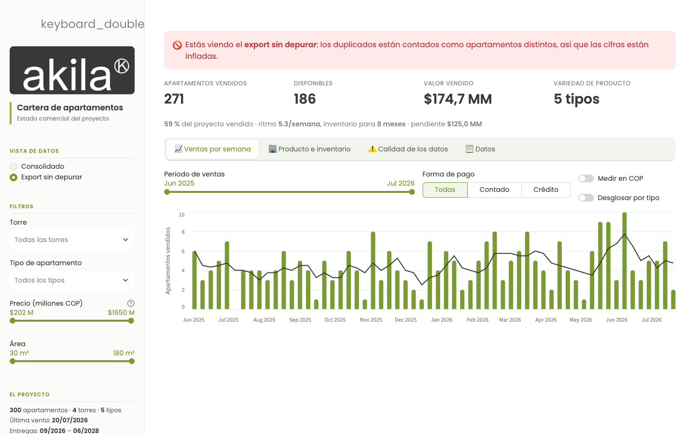
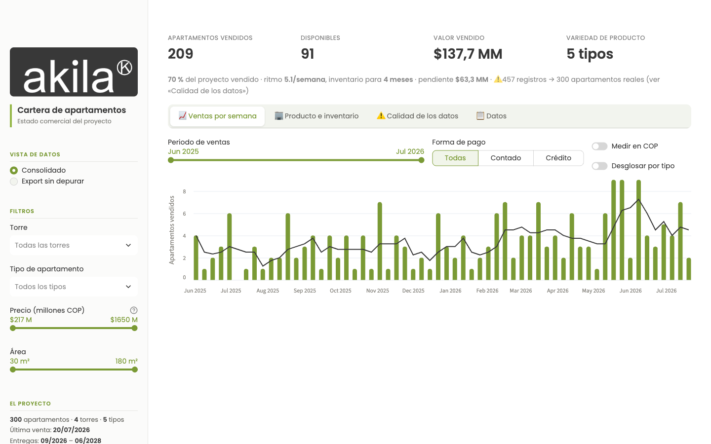
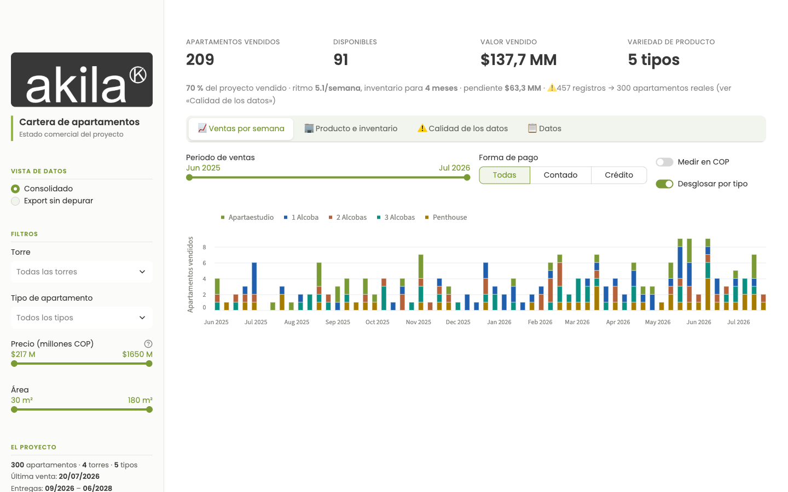
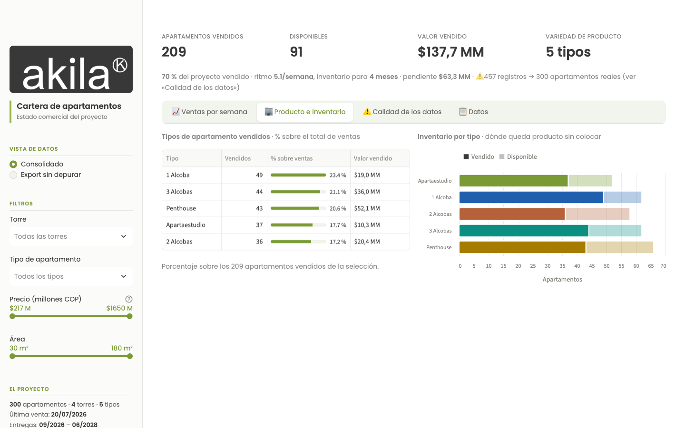

# Ejercicio 2 · Dashboard de ventas de apartamentos

Dashboard para dirección sobre la cartera de un proyecto de vivienda: cuánto se
ha vendido, a qué ritmo, qué producto queda y cuánto durará el inventario.

---

## Cómo ejecutarlo

Desde la **raíz del repositorio**, con el entorno ya instalado
([ver README raíz](../README.md)):

```bash
streamlit run ejercicio2_dashboard/dashboard/app.py
```

Se abre en `http://localhost:8501`.

---

## Lo primero que hay que saber sobre estos datos

El fichero se presenta como «cada fila es un apartamento». No lo es.

**457 filas · 300 apartamentos reales.** 109 unidades aparecen entre dos y siete
veces, y las copias **se contradicen entre sí**: distinto tipo, distinta área,
distinto precio, distinta fecha de entrega y, en 58 casos, distinto estado. Hay
47 unidades que figuran vendidas más de una vez en fechas diferentes.

Un ejemplo real del fichero, `Torre 1 Apto 2003`:

| id | tipo | área | precio | estado | fecha de venta |
|---|---|---|---|---|---|
| 4 | Apartaestudio | 38 m² | $351.400.000 | Disponible | — |
| 397 | 1 Alcoba | 57 m² | $389.600.000 | Vendido | 2026-04-16 |

Mismo apartamento físico (torre, piso y puerta), dos versiones incompatibles.

**Esto cambia las cifras de dirección de forma material:**

| | Leyendo el fichero tal cual | Consolidado |
|---|---|---|
| Apartamentos vendidos | 271 | **209** |
| Disponibles | 186 | **91** |
| Total del proyecto | 457 | **300** |

Presentar «271 vendidos» sería reportar un 30 % de ventas que no existen. Por eso
el dashboard **no esconde el problema**: lo enseña arriba del todo, explica la
regla que aplica y deja comparar ambas lecturas con un selector.



*El selector en «Export sin depurar»: las mismas fórmulas sobre los datos sin
consolidar dan 271 vendidos y un 59 % de avance. El aviso rojo está ahí para que
nadie tome una decisión con esta vista por accidente.*

### La regla de consolidación

Un apartamento se identifica por **torre + piso + puerta**. Cuando hay varias
filas para la misma unidad:

1. **Si alguna dice «Vendido», la unidad está vendida**, y manda el registro de
   la **venta más reciente**. Una venta es un hecho fechado y con contraparte: es
   la evidencia más fuerte que hay en el fichero, y el registro que la acompaña
   (tipo, área, precio) es el que se firmó.
2. **Si no hay ninguna venta**, manda el **último registro** del inventario, por
   ser la versión más actual.

Los empates de fecha se rompen por `id` descendente, así que el resultado no
depende del orden de lectura.

**Alternativas que se consideraron y por qué se descartaron:**

- *Quedarse con la última fila de cada unidad* (id más alto): daría 184 vendidos,
  porque una fila «Disponible» posterior borraría una venta ya registrada. Se
  perderían ventas reales.
- *Eliminar todas las unidades en conflicto*: descartaría 109 de 300 unidades, un
  tercio del proyecto.
- *Promediar los valores en conflicto*: inventaría apartamentos que no existen —
  un «2,5 alcobas» de 65 m² no se le puede enseñar a nadie.

No hay una respuesta única, y por eso la regla está documentada, es configurable
en el código y el dashboard permite ver las dos lecturas.

**Y una hipótesis sobre el origen**, que conecta con el Ejercicio 1: entre los
correos hay uno de un cliente que **desiste de la compra del apartamento 605**.
Si el sistema de origen registra cada operación como una fila nueva en lugar de
actualizar la existente, una unidad vendida, desistida y revendida deja
exactamente el rastro que se ve aquí. El arreglo de fondo no está en el
dashboard: está en el proceso que genera el export.

---

## Qué muestra



**Los cinco apartados del enunciado:**

1. **Ventas por semana** — barras semanales (semanas ISO, etiquetadas por su
   lunes), conmutables entre número de apartamentos y valor en COP, con línea de
   tendencia de 4 semanas. Las semanas sin ventas aparecen con valor cero: un
   parón comercial es información, no un dato ausente.
2. **Apartamentos vendidos** — total, con el porcentaje de avance del proyecto.
3. **Tipos de apartamento vendidos** — tabla con unidades y **% sobre el total
   de ventas**, más el valor vendido por tipo.
4. **Apartamentos disponibles** — cuántos quedan y por cuánto valor.
5. **Variedad de producto** — cuántos tipos distintos hay en el proyecto.

**Y lo que dirección pregunta a continuación:**

- **Ritmo comercial reciente** — media de apartamentos por semana del último
  trimestre.
- **Meses de inventario** — a ese ritmo, cuánto queda hasta agotar lo disponible.
  Es la respuesta directa a «¿cómo va el proyecto?».
- **Inventario por tipo** — dónde se está quedando el producto sin colocar. Cada
  tipo con su color, lo vendido en tono sólido y lo libre en el mismo color
  atenuado, para que la barra se lea como avance.
- **Desglose por tipo de las ventas semanales** — un interruptor convierte el
  gráfico en barras apiladas por producto. Responde a lo que el total no dice:
  no solo cuánto se vendió cada semana, sino **qué** se vendió.



### Cómo está organizado

Los indicadores de cabecera están siempre visibles y el detalle se reparte en
cuatro pestañas: **Ventas por semana**, **Producto e inventario**, **Calidad de
los datos** y **Datos**.

No es una decisión estética. El enunciado pide entender el proyecto «de un
vistazo», y el objetivo de maquetación es concreto: **que el gráfico completo,
con su eje de meses, entre en pantalla sin scroll desde 1280 × 720 hacia
arriba** — lo que queda visible en un portátil de 13" con el navegador
maximizado. Verificado en ocho tamaños, de 1024 × 768 a 1920 × 1080.

Para conseguirlo, el encabezado se mantiene deliberadamente corto: el título
vive en la barra lateral, los indicadores no llevan chips de variación y todo el
contexto —avance, ritmo, inventario, aviso de calidad— cabe en un solo renglón.
Cada línea que se añada ahí le quita altura al gráfico.

### Filtros

Se dividen según su alcance, para que nunca haya duda de qué están afectando:

- **En la barra lateral, los estructurales** (torre, tipo de apartamento, precio,
  área): describen *qué apartamentos* se están mirando y afectan a todo.
- **En la pestaña de ventas, los del periodo comercial** (rango de fechas, forma
  de pago): solo tienen sentido sobre las ventas.

La razón de separarlos es que un apartamento disponible **no tiene fecha de venta
ni forma de pago**. Si esos dos filtros fueran globales, cualquier selección
dejaría el inventario disponible en cero y el tablero mentiría sin avisar.
Dejar una selección vacía significa «todos».



---

## Cómo está construido

```
ejercicio2_dashboard/
├── dashboard/
│   ├── etl.py         # carga, validación, diagnóstico de calidad y consolidación
│   ├── metricas.py    # los indicadores, como funciones puras
│   └── app.py         # la interfaz (solo compone y dibuja)
└── tests/             # 43 de datos + 11 de interfaz
```

**La decisión de diseño principal: el cálculo no vive en la interfaz.** `etl.py` y
`metricas.py` son pandas puro y no importan Streamlit. Eso permite:

- **testear las cifras** sin levantar la aplicación (los *golden tests*
  comprueban los 209 vendidos, los 91 disponibles y los $137.744.900.000 contra
  valores verificados a mano);
- **reutilizar el mismo cálculo** desde otro sitio — un informe programado, un
  notebook, una API — sin duplicar la lógica ni arriesgarse a que dos sitios den
  cifras distintas.

Si el CSV cambia de forma, `validar_esquema()` falla con un mensaje que dice qué
falta. Es preferible a un dashboard que muestra números silenciosamente
equivocados.

### Por qué Streamlit

El problema es un tablero de lectura para dirección, no una aplicación web. Con
Streamlit toda la solución es Python, se ejecuta con un comando, no necesita
compilar nada ni instalar Node, y funciona igual en macOS, Linux y Windows.
Elegir un frontend con build propio habría añadido horas de trabajo y superficie
de fallo sin mejorar en nada lo que dirección ve en pantalla.

Los gráficos son **Altair**, que ya viene con Streamlit: cero dependencias
añadidas.

### La identidad visual

El tablero usa la marca de Akila, no una paleta genérica. Los valores salen de
su propia web: el tema de `akila.com.co` declara `--green: #95b747` y
`--dark-gray: #383838`, y compone en **Poppins**. El logo preside la barra
lateral y los tonos de apoyo —terracota, turquesa— vienen del mundo de sus
proyectos (las fachadas en tonos tierra, la torre «Turquesa»).

**Pero la marca no puede romper la lectura de los datos**, y aquí hubo que
trabajar dos cosas:

- El verde corporativo tal cual se queda en **2,3:1 de contraste** sobre blanco,
  por debajo del mínimo legible de 3:1. En los gráficos se usa oscurecido
  (`#7a9a35`); el original se reserva para detalles de marca sobre fondo claro.
- La pareja natural de su web —verde y naranja— es **indistinguible para el
  daltonismo rojo-verde** (ΔE 3,3). Por eso «vendido» y «disponible» son verde y
  azul: ΔE 28,2 en protanopía.

La paleta de los cinco tipos de apartamento se validó completa con el validador
de la guía de visualización: el peor par contiguo queda en ΔE 10,4 y los cinco
superan 3:1 de contraste. El orden de los colores no es decorativo — es el que
mantiene distinguible cada par adyacente en las barras apiladas.

El color nunca va solo: toda serie lleva leyenda o etiqueta en el eje. El tema
se fija en claro para que el tablero se vea igual en cualquier equipo.

### Pruebas

```bash
pytest ejercicio2_dashboard/tests -v     # desde la raíz del repositorio
```

Cubren la regla de consolidación caso por caso, la validación de esquema (columna
que falta, fecha corrupta, estado desconocido, fichero vacío), el cálculo de cada
indicador y los *golden tests* contra las cifras reales.

**Pruebas de interfaz.** Un fallo de maquetación no lo detecta ningún test de
datos: el tablero puede calcular bien los 209 vendidos y aun así mostrarlos con
el gráfico cortado. `test_interfaz.py` abre el dashboard en un navegador real y
mide la página — que el gráfico entre entero en 1280 × 720 y 1440 × 900, que
ningún indicador quede cortado, que no haya desborde horizontal, que las cuatro
pestañas pinten contenido y que el contraste consolidado/crudo cambie las cifras
de 209 a 271.

Son opcionales y se saltan solas si Playwright no está instalado:

```bash
pip install -r requirements-dev.txt
playwright install chromium
pytest ejercicio2_dashboard/tests/test_interfaz.py
```
